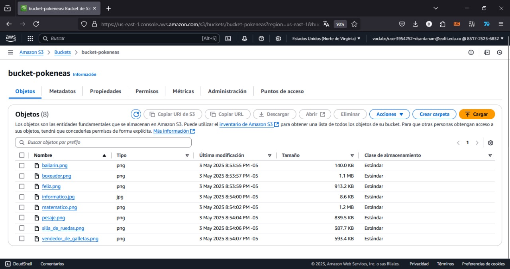
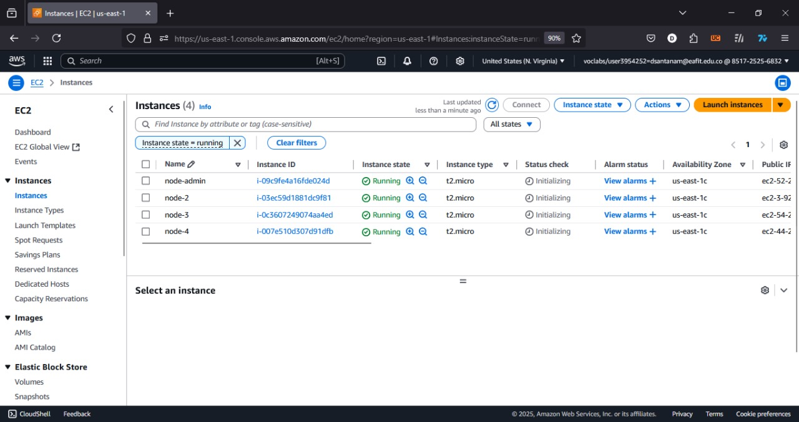
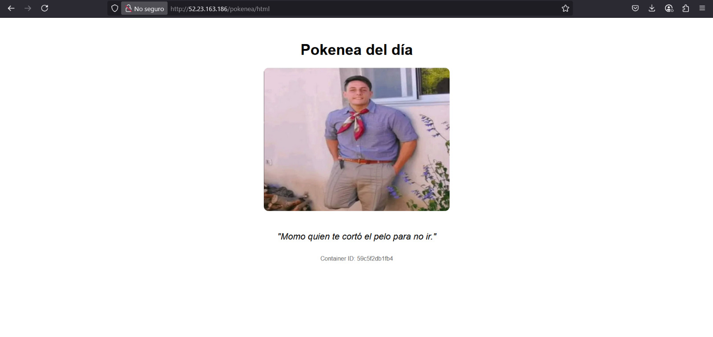
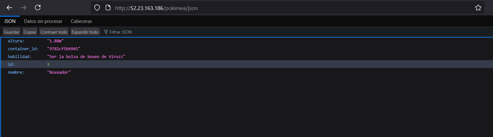
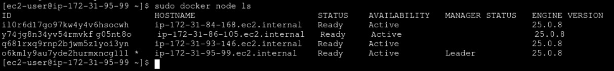
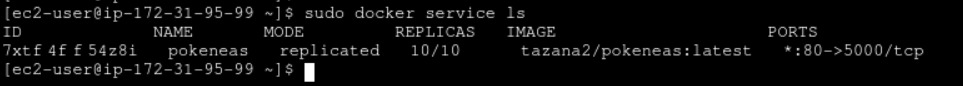

# Taller 02 - Tópicos Especiales en Ingeniería de Software

## Grupo 03
- Daniel Santana Meza
- David Londoño Palacio
- Sebastián Andrés Uribe Ruiz

## Proceso de Implementación

### 1. Creación de Buckets en S3

*Configuración de los buckets de almacenamiento para la aplicación.* **Punto B**

### 2. Despliegue de Instancias EC2

*Instancias de servidor desplegadas en Amazon EC2.*  

### 3. Configuración de la Infraestructura

*Vista general de la configuración de la infraestructura.* **Punto C**

### 4. Configuración del JSON

*Configuración JSON para las definiciones del servicio.*

### 5. Despliegue de Contenedores Docker

*Despliegue de los contenedores Docker para la aplicación.*

### 6. Escalado de Réplicas

*Configuración de réplicas para asegurar alta disponibilidad.* **Punto A**

## Acceso al Proyecto
Para acceder a la aplicación desplegada, visite: [http://35.171.69.43/pokenea/html](http://35.171.69.43/pokenea/html)